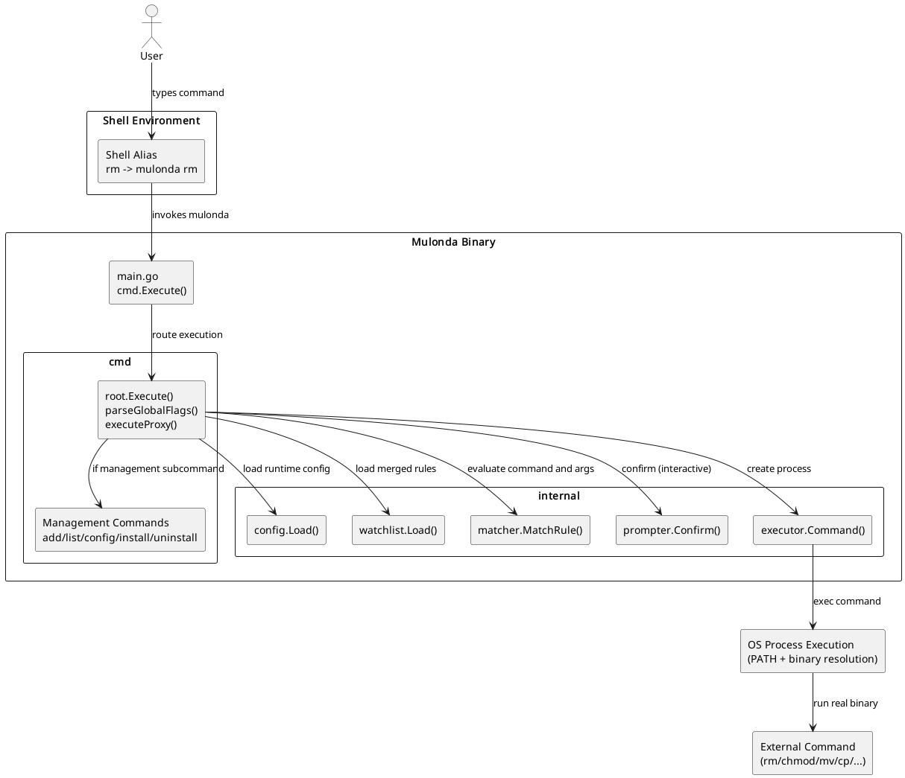
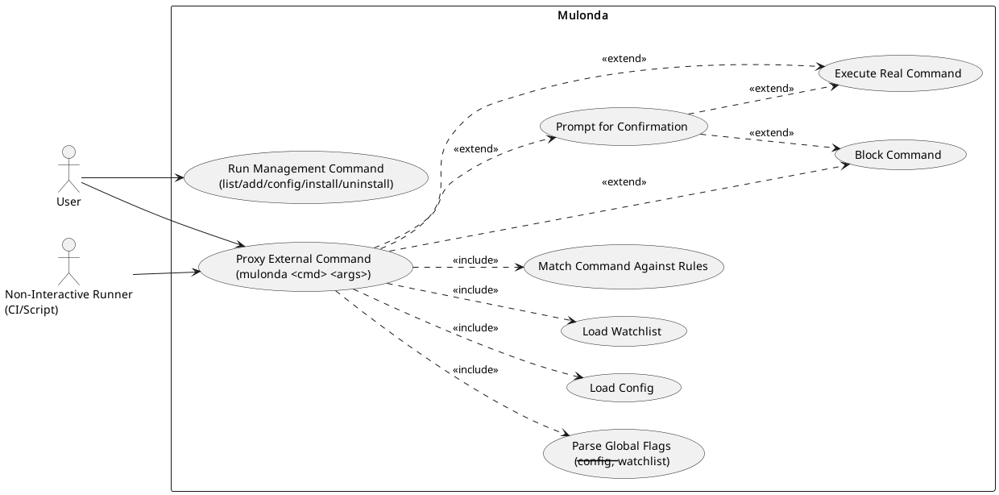
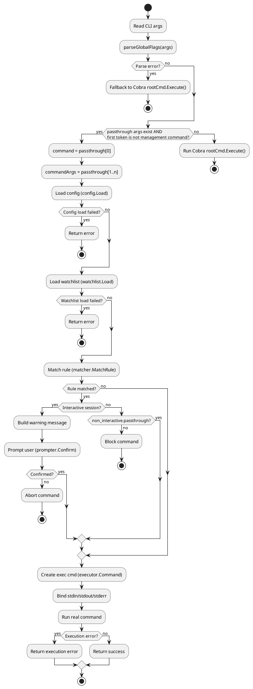
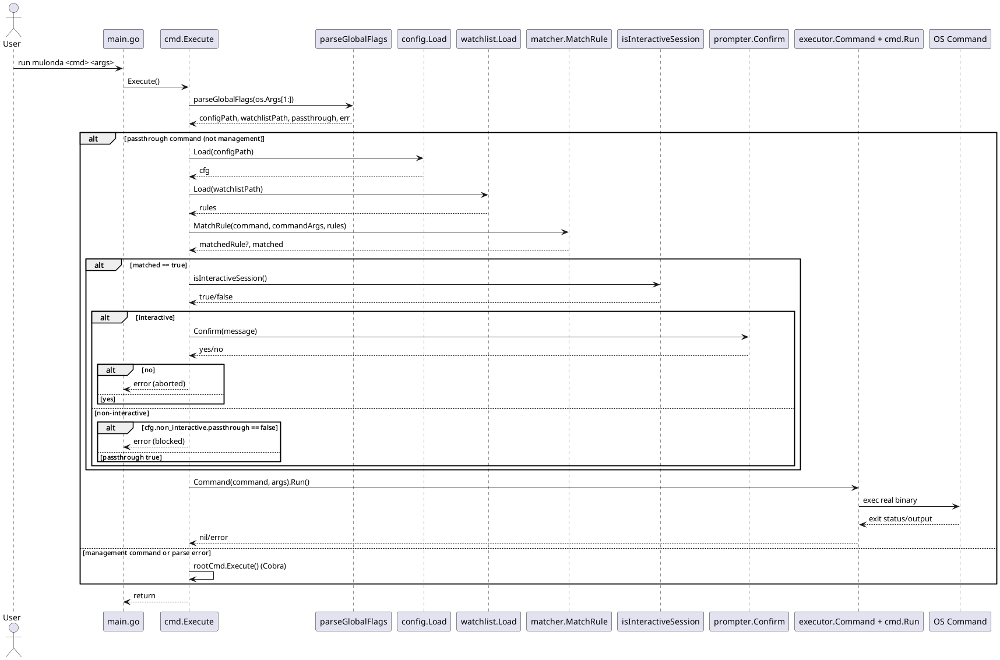
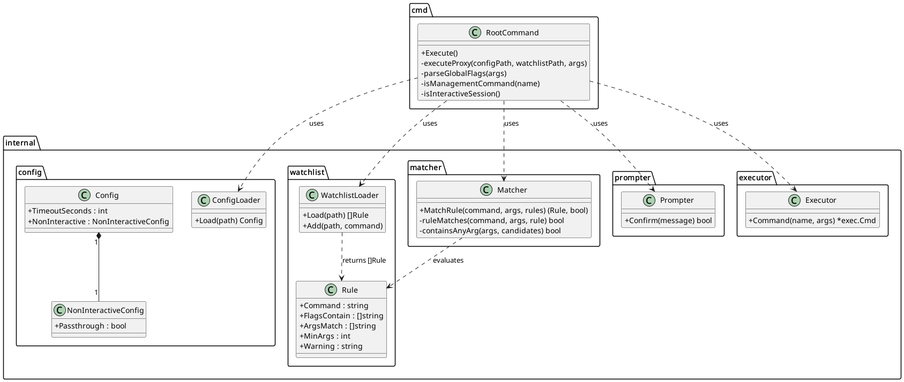

# Mulonda Core Logic Diagrams

This directory contains PlantUML source files documenting Mulonda's current core proxy/intercept behavior.

## Diagrams

- `architecture.puml` - High-level component architecture and module boundaries.
- `use-case.puml` - Primary user/system use cases for command guarding.
- `activity-core-flow.puml` - Core runtime decision flow for `mulonda <command> ...`.
- `sequence-core-flow.puml` - Detailed interaction timeline for proxy execution.
- `class-diagram.puml` - Static structure of key types and functions involved in core logic.

## Rendered Outputs

Generated outputs are committed alongside each `.puml` file in both formats:

- `.png` (raster preview)
- `.svg` (scalable/vector)

## Previews

### Architecture

[Open SVG](./architecture.svg)

### Use Case

[Open SVG](./use-case.svg)

### Activity (Core Flow)

[Open SVG](./activity-core-flow.svg)

### Sequence (Core Flow)

[Open SVG](./sequence-core-flow.svg)

### Class Diagram

[Open SVG](./class-diagram.svg)

